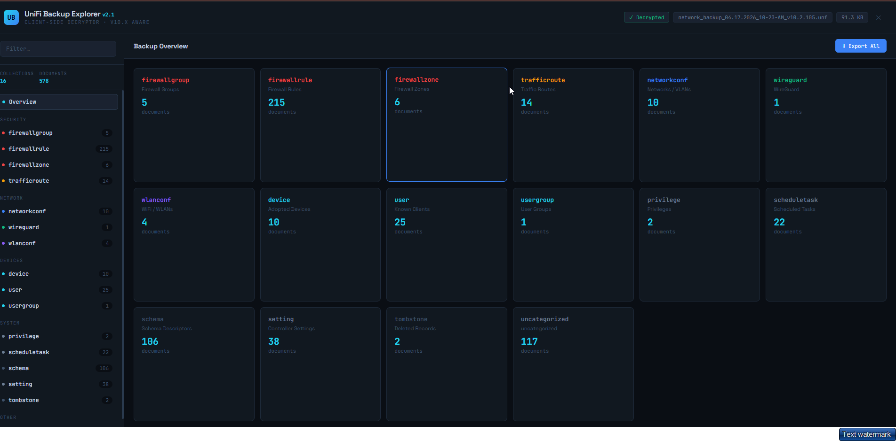

# UniFi Backup Explorer

Browser-based decryptor and explorer for UniFi Network Application backup files (`.unf`). No installation. No terminal. No data leaves your machine.

## Why this exists

The existing tools for decrypting UniFi `.unf` backups are command-line only — they need OpenSSL, `mongo-tools`, `bsondump`, and a working bash environment just to look at what's in a backup. That's a high bar for anyone who just wants to audit their own network configuration.

This tool does everything in the browser. Drag the `.unf` file onto the page, read your configuration.

## Features

- **Single-file HTML** — no installation, no local package managers, no terminal. Loads JSZip and pako from cdnjs at runtime (locked with SRI hashes).
- **Fully client-side** — decryption happens in your browser via the Web Crypto API
- **16 categorised collections** — firewall groups, rules, zones, traffic routes, networks/VLANs, WireGuard peers, WiFi SSIDs, devices, users, user groups, privileges, scheduled tasks, schema, settings, tombstones, uncategorised
- **Grouped navigation** — Security / Network / Devices / System / Other
- **Live filter** — search across collections and documents
- **Credential-aware** — warns on export that JSON contains plaintext WiFi passphrases, WireGuard keys, PPPoE passwords, and RADIUS secrets
- **UniFi Network 10.x aware** — tested against current backup format

## How to use

1. Download `unifi_backup_explorer_v2.html` from this repository
2. Open it in any modern browser (Chrome, Firefox, Safari, Edge)
3. Drag your `.unf` backup file onto the page
4. Browse the parsed collections and export what you need

## Security model

- Decryption runs entirely in the browser using the Web Crypto API
- Read-only — the tool never writes back to the backup file
- No network requests are made after page load — decryption, parsing, and rendering are all local
- CDN dependencies locked with Subresource Integrity (SRI) hashes
- Content Security Policy applied to limit attack surface
- Nothing is stored, logged, or transmitted

The encryption key used by UniFi backups is a publicly documented constant. This tool does not bypass any security — it uses the same key the controller uses.

## Audit history

The code has been through multiple security review passes:

- Initial Opus red team and Gemini passes before first publication
- Claude Code `/review` and `/security-review` on Sonnet 4.6
- Claude Code `/ultrareview` on Opus 4.7

Findings addressed include XSS escaping, event delegation, BSON parser hardening (bounds checking, recursion limits, prototype pollution protection), credential export warnings, CSP improvements, and SRI integrity hashes. See the commit history for details.

## Export warning

Exported JSON contains credentials in cleartext — WiFi passphrases, WireGuard keys, PPPoE passwords, RADIUS secrets. Treat exported files with the same care as the backup itself.

## Hosting note

If this page is ever served over HTTP rather than opened as a local file, set `Content-Security-Policy` and `X-Frame-Options: DENY` as server response headers.

## License

MIT — see [LICENSE](LICENSE).

## Author

Chris Mallia — [CM Networks](https://mallianet.com)
